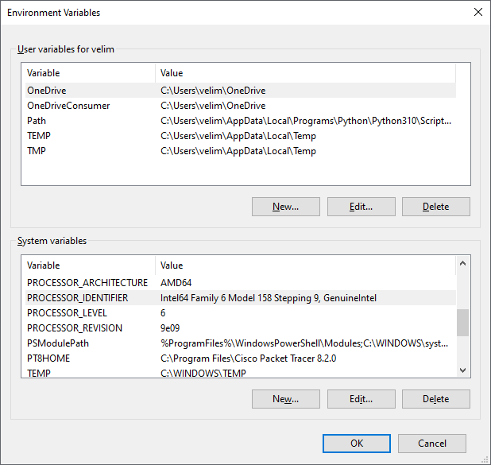

# Аргументи командне линије

## Увод

Од раније је познато да је најважнија функција у програмском језику C фунцкија `main()`. Њу можеш дефинисати једноставно - без навођења типа, аргумената и вредности коју враћа: `main(){}`. Функција `main()` је функција целобројног типа, јер враћа целобројну вредност процесу оперативног система у којем је програм покренут - враћа `0` ако је програм успешно извршен, односно цео број различит од нуле ако је било проблема током извршавања програма. Ако се функцији `main()` не прослеђују аргументи, онда у загради можеш навести кључну реч `void`.  

```c
int main(void)
{
    return 0;
}
```

## Аргументи командне линије

Аргументи се могу проследити функцији `main()` путем процеса оперативног система у којем је програм покренут, што је обично командна линија. Командна линија у оперативном систему Windows може бити Command Prompt или PowerShell. Због тога се аргументи функције `main()` називају **аргументи командне линије** *(engl. Command Line Arguments)*. У програмском језику C аргументи командне линије су унапред дефинисани и називају се `argc` и `argv`.

```c
int main(int argc, char *argv[])
{
    return 0;
}
```

Аргумент `argc` *(енгл. ***ARG***ument ***C***ount)* је целобројна променљива која чува број аргумената. Аргумент `argv[]` *(енгл. ***ARG***ument ***V***ector)* је низ показивача на стрингове у којима се чувају аргументи. Први елемент овог низа `argv[0]` је увек име извршног фајла, након чека следе елементи који чувају аргументе задате у командној линији.

Креирај фајл `argumenti.c` и у њега унеси следећи програм:

```c
#include <stdio.h>

int main(int argc, char* argv[])
{
    printf("Broj unetih argumenata: %d\n", argc);
    for (int i = 0; i < argc; i++)
        printf("Argument %d: %s\n", i, argv[i]);
    return 0;
}
```

Компајлирај и покрени извршни фајл у директоријуму где се извршни фајл и налази, наводећи само његово име `argumenti.exe` (без аргумената). На излазу ће бити исписано:

```
Broj unetih argumenata: 1
Argument 0: argumenti.exe
```

Шокрени извршни фајл из другог директоријума, наводећи путању до извршног фајла и његово име, `C:\Program\x64\Debug\argumenti.exe` (без аргумената). На излазу ће бити исписано:

```
Broj unetih argumenata: 1
Argument 0: C:\Program\x64\Debug\argumenti.exe
```

Покрени извршни фајла наводећи његово име и аргументе, на пример: `argumenti.exe Hello, World!`. На излазу ће бити исписано:

```
Broj unetih argumenata: 3
Argument 0: argumenti.exe
Argument 1: Hello,
Argument 2: World!
```

Стринг `Hello, World!` можеш проследити и као један аргумент ако користиш наводнике: `argumenti.exe "Hello, World!"`. У овом случају, на излазу ће бити исписано:

```
Broj unetih argumenata: 2
Argument 0: argumenti.exe
Argument 1: Hello, World!
```

## Задаци

### Задатак 1

Напиши програм `ime.c` који на излазу исписује: `Ti se zoves: ime_korisnika. Ti se prezivas: prezime_korisnika.`, где се име и презиме корисника прослеђују као аргументе командне линије. Ако је корисник у командној линији навео мање од два аргумента након имена извршног фајла, на излазу исписати поруку о грешци: `Noras uneti ime i prezime!`. Ако је навео више од два, на излазу исписати поруку о грешци: `Unesi samo ime i prezime!`

Ако је корисник навео тачно тачно два аргумента након имена извршног фајла, онда ће `argc` добити вредност `3`, где је `argv[0]` стринг у којем се чува име извршног фајла, `argv[1]` стринг у којем се чува име корисника и `argv[2]` стринг у којем се чува презиме корисника. Ако је навео мање од два, онда ће `argc` добити вредност мању од `3`, односно, ако је навео више два, `argc` ће добити вредност већу од `3`.

```c
#include <stdio.h>

int main(int argc, char* argv[])
{
    if (argc < 3)
        printf("Moras uneti ime i prezime!");
    else if (argc == 3)
        printf("Ti se zoves: %s. Ti se prezivas: %s.", argv[1], argv[2]);
    else
        printf("Unesi samo ime i prezime!");
    return 0;
}
```

Ако је прослеђен недовољан број аргумената:

```
C:\Program\x64\Debug\>ime.exe Velimir
Moras uneti ime i prezime!
```

Ако је прослеђен коректан број аргумената:

```
C:\Program\x64\Debug\>ime.exe Velimir Radlovacki
Ti se zoves: Velimir. Ti se prezivas: Radlovacki.
```

Ако је прослеђен превелик број аргумената:

```
C:\Program\x64\Debug\>ime.exe Velimir Radlovacki Bata
Unesi samo ime i prezime!
```

### Задатак 2

Напиши програм `zbir.c` који на излазу исписује збир два цела броја која су му прослеђена као аргументи командне линије. Ако је корисник у командној линији навео мање или више од два аргумента након навођења имена извршног фајла, на излазу исписати поруку о грешци: `Unesi dva cela broja!`.

Ако желиш да користиш аргументе команде линије као целе или реалне бројеве, онда су ти потребне функције за претварање стрингова у целе, односно у реалне бројеве. У овом случају можеш користити библиотечку функцију `atoi()` из `stdlib.h` која претвара стринг у цео број.

```c
#include <stdio.h>
#include <stdlib.h>

int main(int argc, char* argv[])
{
    if (argc == 3)
        printf("%d", atoi(argv[1]) + atoi(argv[2]));
    else
        printf("Unesi dva cela broja!");
    return 0;
}
```

Постојање аргумената командне линије можеш проверити и на други начин - упоређивањем елемената низа `argv[]` са `NULL`. Тако претходни програм можеш написати на следећи начин:

```c
#include <stdio.h>
#include <stdlib.h>

int main(int argc, char* argv[])
{
    if (argv[1] != NULL && argv[2] != NULL)
        printf("%d", atoi(argv[1]) + atoi(argv[2]));
    else
        printf("Unesi dva cela broja!");
    return 0;
}
```

### Задатак 3

Напиши програм `evroursd.c` који на излазу исписује производ два реална броја која су му прослеђена као аргументи командне линије. Прослеђени бројеви су износ у еврима и курс евра, а резултат на излазу износ у динарима. Износ у динарима треба да буде представљен као реалан број са два децимална места. Ако је корисник у командној линији навео мање или више од два аргумента након навођења имена извршног фајла, на излазу исписати поруку о грешци: `Unesi iznos u evrima i kurs evra!`.

У овом случају можеш користити библиотечку функцију `atof()` из `stdlib.h` која претвара стринг у реалан број.

```c
#include <stdio.h>
#include <stdlib.h>

int main(int argc, char* argv[])
{
    if (argc == 3)
        printf("%.2f", atof(argv[1]) * atof(argv[2]));
    else
        printf("Unesi iznos u evrima i kurs evra!");
    return 0;
}
```

## ДОДАТНО

Већина C/C++ компајлера подржава и трећи аргумент `envp[]` *(енгл. ***ENV***ironment ***P***ointer)*. Овај аргумент је низ показивача на стрингове у којима се чувају променљиве окружења *(енгл. Environment Variables)*. Променљиве окружења можеш да видиш кликом на `START` дугме и уносом `Edit environment variables for your account`.



Извршавање следећег програма исписаће се променљиве окружења:

```c
#include <stdio.h>

int main(int argc, char* argv[], char* envp[])
{
    for (int i = 0; envp[i] != NULL; i++)
        printf("%s\n", envp[i]);
    return 0;
}
```

**НАПОМЕНА!** Аргумент `envp[]` није стандардни аргумент и нећемо га користити. Параментре окружења можеш добити и на други начин - на пример користећи функцију `getenv` дефинисану у `stdlib.h`.

```c
#define _CRT_SECURE_NO_WARNINGS
#include <stdio.h>
#include <stdlib.h>

int main(void)
{
    char* pPath = getenv("PATH");
    if (pPath != NULL)
        printf("PATH: %s", pPath);
    return 0;
}
```