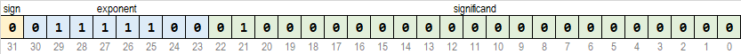
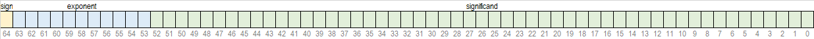

# Реални тип

Реални типови података служе за представљање реалних бројева, тзв. бројева са
покретном тачком *(енгл. floating point)*, а не запетом као у математици.
У рачунарским наукама бројеви са покретном тачком приближно представљају реалне
бројеве користећи негативан или ненегативан знак испред целог броја фиксне
прецизности помножен целобројним експонентом фиксне основе. На пример:

$$-12.345 = -12345 \times 10^{-3}$$

Са леве стране налази се негативан реалан број, а са десне:

- `-` представља знак *(енгл. sign)*,
- `12345` представља сигнификанд или мантису *(енгл. significand или mantissa)*,
- `-3` представља експонент *(енгл. exponent)* и
- `10` представља основу *(енгл. base или radix)*.

Израз "покретна тачка" односи се на чињеницу да се тачка *(енгл. radix point)*
креће између цифара броја.

У програмском језику C опсег вредности и прецизност бројева са покретном тачком
зависи од декларације, од архитектуре рачунарског система и од компајлера. У већини
случајева важи следеће:

| Tип           | Опсег                                 | Прецизност | B  | Спецификатор                                    |
| ------------- | ------------------------------------- | ---------- | -- | ----------------------------------------------- |
| `float`       | $1.175494E-38$ ... $3.402823E+38$     |  6         | 4  | `%f` `%F` `%g` `%G` `%e` `%E` `%a` `%A`         |
| `double`      | $2.225074E-308$ ... $1.797693E+308$   | 15         | 8  | `%lf` `%lF` `%lg` `%lG` `%le` `%lE` `%la` `%lA` |
| `long double` | $3.362103E-4932$ ... $1.189731E+4932$ | 18         | 16 | `%Lf` `%LF` `%Lg` `%LG` `%Le` `%LE` `%La` `%LA` |

Број са покретном тачком типа `float` има **једноструку прецизност** и заузима
$4B$ меморијског простора. $1b$ резервисан је за знак, $8b$ за експонент са
основом 2 и $23b$ за сигнификанд. На пример, ако је у меморијској локацији
резервисаној за чување реалног броја типа `float` уписано:



$b_{31}=0$

што значи да је знак $(-1)^{b^{31}}=(-1)^0=+1$

$b_{30}\ldots b_{23}=01111100=124$

што значи да је експонент $2^{124-127}=2^{-3}=0.125$

$b_{22}\ldots b_{0}=2^{-2}=0.25$

што значи да је сигнификанд $1+0.25=1.25$

Реалан број у декадном систему: $+1\times 0.125\times 1.25 = +0.15625$

Број са покретном тачком типа `double` има **двоструку прецизност** и заузима
$8B$ меморијског простора. $1b$ резервисан је за знак, $11b$ за експонент са
основом 2 и $52b$ за сигнификанд.



Број са покретном тачком типа `long double` има **проширену прецизност** и
заузима:

- $10B$ меморијског простора, или
- $12B$ меморијског простора, или
- $16B$ меморијског простора.

Иронично, изузетак је баш Microsoft C/C++ компајлер који се користи у овом
предмету, где је тип `long double` идентичан типу `double`, што значи да број
са покретном тачком типа `long double` заузима $8B$, меморијског простора
[🔗](https://learn.microsoft.com/en-us/cpp/c-language/type-long-double).
Број са покретном тачком може има **четвороструку прецизност** ако заузима
$16B$ меморијског простора. Имплементација таквог типа постоји у новијим
верзијама C компајлера [🔗](https://gcc.gnu.org/onlinedocs/libquadmath.pdf).
Пошто у задацима ретко има потребе за бројевима са покретном тачком проширене
или четвороструке прецизности, они се неће користити.

Информације о типовима `float`, `double` или `long double` на конкретном
рачунарском систему могу се добити помоћу макроа дефинисаних у библиотеци
`float.h`, као у следећем програму:

```c
--8<-- "docs/c/code/floatlimits.c"
```

Преузми: [floatlimits.c](code/floatlimits.c)
