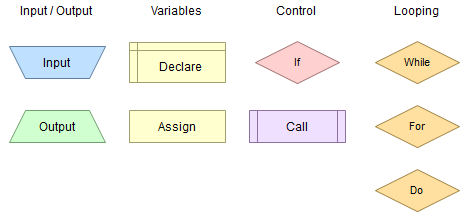

# Графички запис алгоритама

Дијаграм тока или алгоритамска шема служи за графички приказ структуре алгоритма помоћу одређених графичких симбола. Постоји више стандарда и техника за записе алгоритамских шема, а ми ћемо користити **Classic (Trapezoid)** стил из софтвера [Flowgorithm](flowgorithm.md).

