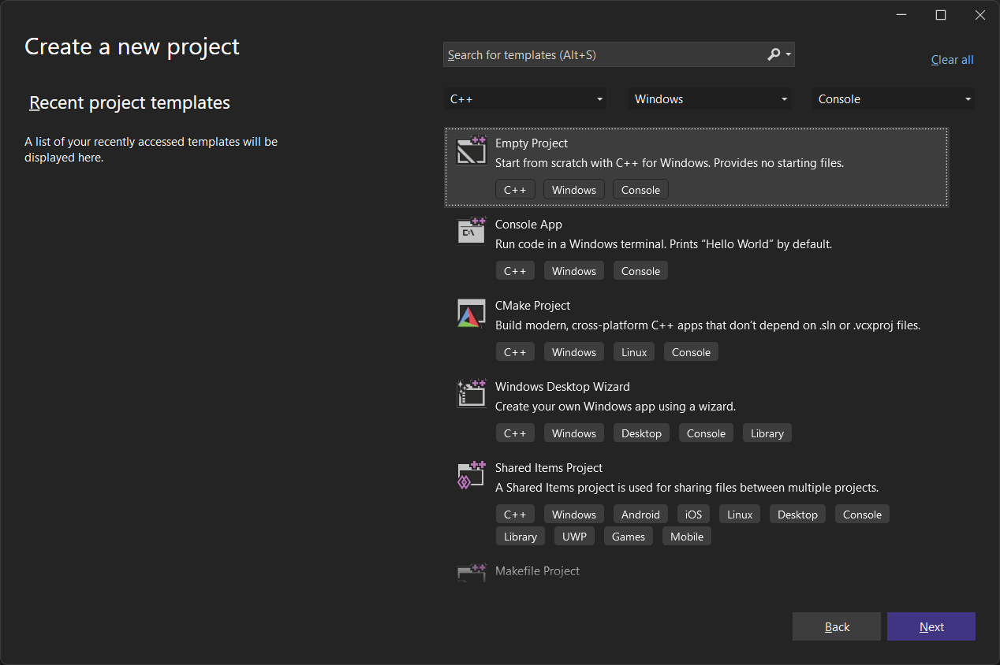
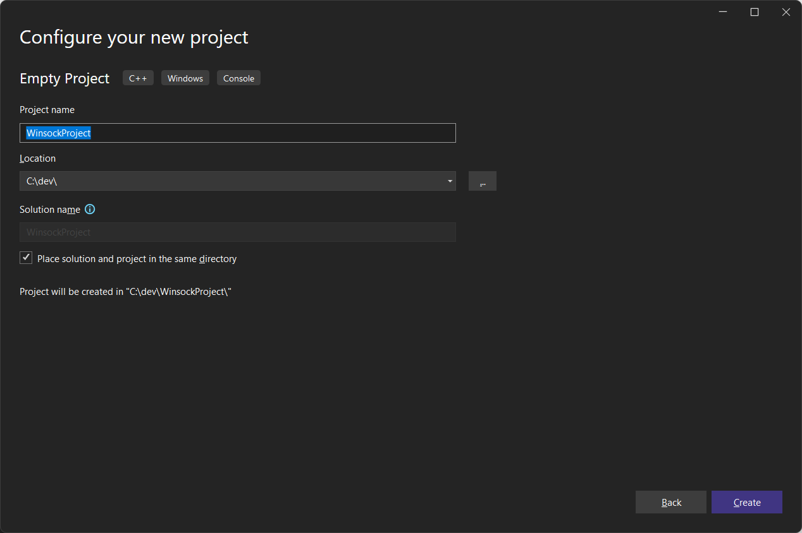
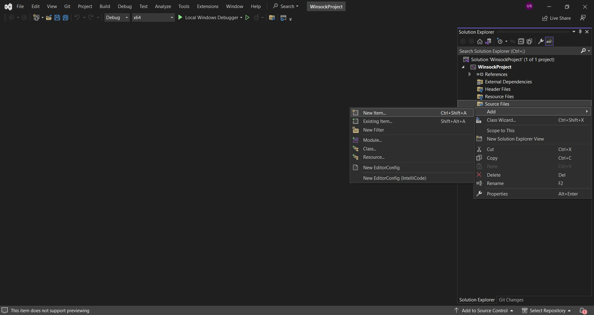
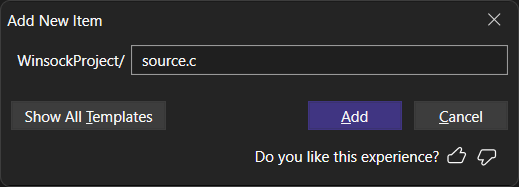

# Припрема пројекта

## Креирање новог C пројекта

Winsock пројекат у развојном окружењу Visual Studio креира се као и стандардни
пројекти у програмском језику C. Потребно је одабрати празан C++ пројекат
(`Empty Project`) и кликнути дугме "Даље" (`Next`):



потом унети име пројекта (`Project Name`), унети локацију (`Location`),
штиклирати да се решење налази у истом директоријуму као и пројекат
(`Place solution and project in the same directory`) или унети име решења
(`Solution Name`) и кликнути дугме "Креирај" (`Create`):



У креираном пројекту десним кликом на "Изворни фајлови" (`Source Files`) треба
одабрати "Додај" (`Add`), па "Нова ставка" (`New Item`):



и на крају унети име датотеке са изворним кодом, обавезно са `c` екстензијом:

{ width="360" }

## C Winsock пројекат

У заглављу изворног кода програма који користи Winsock је поред `<stdio.h>`
библиотеке потребно укључити и библиотеке `<winsock2.h>` и `"ws2_32.lib"` које
се дистрибуирају у оквиру *Microsoft Windows Software Development Kit (SDK)*
пакета. Библиотека `"ws2_32.lib"` може се укључити у заглављу помоћу
`#pragma comment(lib, "ws2_32.lib")`. Други начин је да се у менију одабере
`Project` - `Project Properties` - `Configuration Properties - Linker - Input`
и измени поље `Additional Dependencies` додавањем `"ws2_32.lib"`. Датотеке
`<winsock2.h>` и `"ws2_32.lib"` дистрибуиране су у оквиру пакета

``` c
#define _CRT_SECURE_NO_WARNINGS
#include <stdio.h>
#include <winsock2.h>
#pragma comment(lib, "ws2_32.lib")

int main(void)
{
    // ...
    return 0;
}
```
