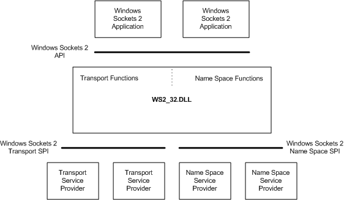

# Увод

Windows Sockets 2 (Winsock) омогућава програмерима да креирају напредне мрежне
апликације за пренос података између апликација, независно од мрежног протокола
који се користи. Winsock користи парадигму сокета коју је први популаризовао
BSD UNIX *(Berkeley Software Distribution UNIX)*. Дизајниран је за C/C++
програмере који познају Windows Networking концепте и може се користити на свим
Windows платформама.

Winsock је изграђен по моделу Windows отворене системске архитектуре
*(енгл. WOSA - Windows Open System Architecture)* дефинишући стандардни
интерфејс добављача услуга *(енгл. SPI - Service Provider Interface)* између
интерфејса за програмирање апликације *(енгл. API - Application Programming
Interface)*, са његовим функцијама и стеком протокола.

Тренутна верзија Winsock спецификације је верзија 2.2. Тренутна `Winsock DLL`,
`ws2_32.dll`, подржава апликације које могу да користе Winsock спецификације
верзија:

- 1.0
- 1.1
- 2.0
- 2.1
- 2.2

## Подржани протоколи

- IPv6
- IPv4
- NetBIOS
- IrDA
- Bluetooth
- IPX/SPX (WinXP/Server2003 и старије верзије)
- AppleTalk (WinXP/Server2003 и старије верзије)
- DLC (Win2000)
- ATM (WinXP/Server2003 и старије верзије)
- NetBEUI (Win2000)

## Архитектура

