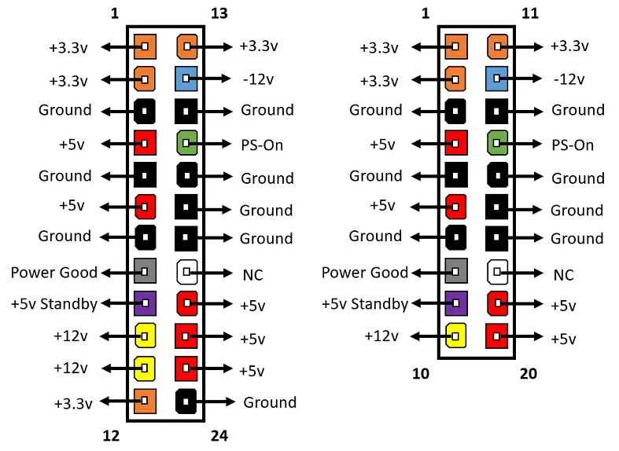
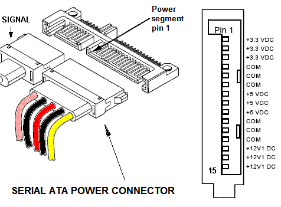
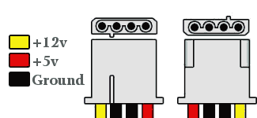
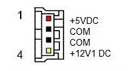
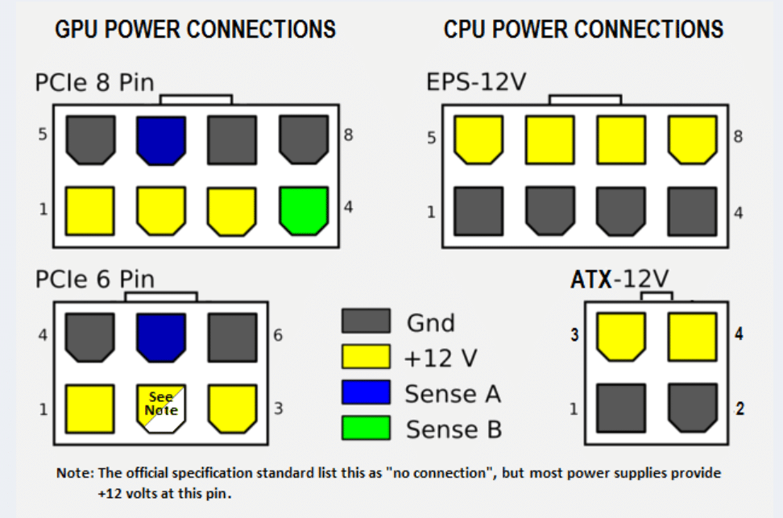

# Конектори напајања

Најапање треба изабрати и на основу потребних конектора за напајање унутрашњих
компоненти. Конектори који долазе из напајања обично су:

- 20-пински или 24-пински конектор (конектује се на матичну плочу)
- SATA конектор (обично се конектује на меморије за складиштење)
- Molex конектор (обично се конектује на меморије за складиштење)
- Berg конектор (обично се конектује на флопи диск драјвове – застарео)
- 4-пински до 8-пински конектор (конектује се на матичну плочу)
- 6-пински или 8-пински PCI-E конектор (обично се конектује на графичку картицу)

<figure markdown>
  { width="100%" }
  <figcaption>Конектори напајања</figcaption>
</figure>

## ATX12V 24 и 20 пински конектори

<figure markdown>
  { width="100%" }
  <figcaption>ATX12V 24 и 20 пински конектори</figcaption>
</figure>

## SATA напајање

Стари стандард:

<figure markdown>
  { width="480" }
  <figcaption>SATA напајање</figcaption>
</figure>

- Пин 1: +3.3v
- Пин 2: +3.3v
- Пин 3: +3.3v

Нови стандард:

<figure markdown>
  { width="480" }
  <figcaption>SATA напајање</figcaption>
</figure>

- Пин 1: Reserved
- Пин 2: Reserved
- Пин 3: PWDIS - Power Disable

## Molex

<figure markdown>
  { width="320" }
  <figcaption>Молекс конектор</figcaption>
</figure>

## 4-пински Berg FDD конектор

<figure markdown>
  { width="240" }
  <figcaption>4-пински Берг флопи диск драјв конектор</figcaption>
</figure>

## Конектори за CPU и GPU (PCI-E) напајање

<figure markdown>
  { width="480" }
  <figcaption>CPU и GPU (PCI-E) напајање</figcaption>
</figure>
