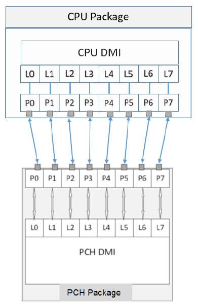

# Савремени рачунарски системи

## Основа рачунарског система

Основу рачунарског система чини првенствено процесора и чипсет. Раније је
процесор био чип у којем се налази само једно процесорско језгро. Данас се у
процесору обично налази: више процесорских језгара; L1, L2, L3 кеш меморија,
контролер меморије, графички процесор и интерфејс, PCIe интерфејс, PCH интефејс
и др. Раније је главни део чипсета био у виду северног и јужног моста - два
чипа на матичној плочи. Данас се главни део чипсета налази у једном чипу који
се зове **PCH** (енгл. *Platform Controller Hub*), односно, преведено на српски
језик, чворишни контролер платформе.

На пример, савремени рачунарски систем са Intel процесором генерације 12 и
Intel чипсетом серије 600 изгледа овако:

<figure markdown>
  { width="480" }
  <figcaption>Intel CPU генерације 12 и чипсет серије 600</figcaption>
</figure>

## Процесор

- комуницира директно са чипсетом путем **DMI** (енгл. *Direct Media
Interface*) интерфејса:

<figure markdown>
  { width="320" }
  <figcaption>DMI - Direct Media Interface</figcaption>
</figure>

- подржава DDR4 и DDR5 меморију - 2 канала (2 **CH**) по 2 меморијска модула по
каналу (2 **DPC**, тј. 2 *DIMM per channel*),
- има 2 PCI Express интерфејса - 16-канални и 4-канални,
- подржава до 5 дигиталних видео излаза - један за **DP** (енгл. *DisplayPort*)
1.4b и четири за **DP** 1.4a или **HDMI** 2.0b.

## Чипсет

- комуницира директно са процесором путем DMI интерфејса,
- подржава 7 USB 3.2 порта: четири 20 GB/s, два 10 GB/s и један 5 GB/s порт,
- подржава дискретни Thunderbolt 4,
- има 2 PCI Express интерфејса - 16-канални и 12-канални,
- има SATA интерфејс,
- има интегрисан Wi-Fi 5 и подржава дискретни Wi-Fi 6,
- има 2.5-гигабитни Етернет,
- има HD аудио,
- има SMBus (енгл. *System Management Bus*) контролер и
- има SPI (енгл. *Serial Peripheral Interface*) и eSPI (енгл. *Enhanced SPI*)
интерфејсе за комуникацију са UEFI/BIOS чипом и различитим хардвером.

Захваљујући оваквом степену интеграције компонената елиминисана су многа "уска
грла" у систему и могући проблеми са компатибилношћу.

Тако, у кућишту једне савремене рачунарске конфируграције може да се налази:

<figure markdown>
  { width="320" }
  <figcaption>Савремена рачунарска конфигурација</figcaption>
</figure>

1. напајање,
2. матична плоча са Intel чипсетом серије 600,
3. Intel процесор генерације 12 са хладњаком,
4. DDR4 или DDR5 меморијски модули,
5. опционо, додатне картице
6. NVMe SSD за складиштење података.

Овако једноставна конфигурација већ поседује графички адаптер довољно добар за
већину уобичајених послова који се обављају на рачунару, аудио адаптер, мрежне
адаптере за жично и бежично повезивање и довољно интерфејса за повезивање свих
периферних уређаја који су неопходни чак и захтевном кориснику.

Шта се у међувремену (у претходних 20-ак година) изгубило:

- Floppy диск контролер/интерфејс,
- IDE диск контролер/интерфејс,
- VGA интерфејс,
- Серијски COM и паралелни LPT портови,
- Game порт,
- IrDA порт,
- *PS/2 портови итд.
