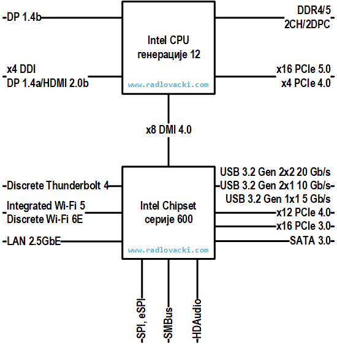

# Савремени рачунарски системи

Савремени рачунарски системи организован је првенствено око процесора и
чипсета. Раније је процесор био чип у којем се налази само једно процесорско
језгро. Данас се у процесору обично налази: више процесорских језгара; L1, L2,
L3 кеш меморија, контролер меморије, графички процесор и интерфејс, PCIe
интерфејс, PCH интефејс и др. Раније је главни део чипсета био у виду северног
и јужног моста - два чипа на матичној плочи. Данас се главни део чипсета налази
у једном чипу који се зове **PCH** (енгл. *Platform Controller Hub*), односно,
преведено на српски језик, чворишни контролер платформе.

На пример, савремени рачунарски систем са Intel процесором генерације 12 и
Intel чипсетом серије 600 изгледа овако:

<figure markdown>
  { width="480" }
  <figcaption>Intel CPU генерације 12 и чипсет серије 600</figcaption>
</figure>

CPU комуницира директно са чипсетом путем интерфејса који се зове **DMI**
(енгл. *Direct Media Interface*):

<figure markdown>
  { width="320" }
  <figcaption>DMI - Direct Media Interface</figcaption>
</figure>

Процесорска графика подржава до пет дигиталних видео излаза. Један за **DP**
(енгл. *DisplayPort*) 1.4b и четири за **DP** 1.4a или **HDMI** 2.0b.

Процесор подржава DDR4 и DDR5 меморију кроз два канала (2 **CH**) са највише
два меморијска модула по каналу (2 **DPC**, тј. 2 *DIMM per channel*).

Процесор има два PCI Express интерфејса - један 16-канални и један 4-канални.  
