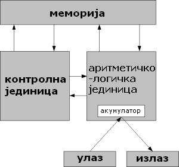

# Увод

Претходне школске године из предмета Увод у архитектуру рачунара учио си о
теоријским основама архитектуре рачунара, процесора и меморије. Циљ овог
предмета није продубљивање теоријских основа архитектуре рачунарских система,
већ практичан рад са рачунарских хардвером и то:

- склапање рачунара,
- надоградња рачунара и
- тестирање рачунара.

Ни за овај предмет **не постоји уџбеник**, па је **обавезно да имаш свеску на
сваком часу**!

Претходне школске године учио си о фон Нојмановој архитектури рачунара (која
потиче из 1945. године) и која рачунар посматра кроз пет основних целина:

- меморија,
- аритметичко логичка јединица,
- контролна јединица,
- улазни уређаји и
- излазни уређаји.

<figure markdown>
  { width="320" }
  <figcaption>Фон Нојманова архитектура</figcaption>
</figure>

Идеје и принципи рада вон Нојманове машине дали су основу за даљи развој
рачунарских система. Данас се развијају рачунари четврте и пете генерације у
виду:

- уграђених рачунара,
- рачунара изведених на једној плочи,
- паметних телефона и таблета,
- преносивих рачунара,
- десктоп рачунара,
- сервера и
- супер рачунара.

Архитектуре ових рачунара у неким сегментима су сличне, док се у другим потпуно
разликују. У овом предмету фокус ће бити на класичним персоналним десктоп
рачунарима. Десктоп рачунари и даље су незаменљиви инвентар у компанијама које
се баве различитим делатностима. Зашто?

1. **Могућност сервисирања.** Десктоп рачунари су дизајнирани за лако одржавање
и поправку. Компоненте су обично стандардизоване и доступне, што олакшава
дијагностику и отклањање хардверских проблема.
2. **Надоградивост.** Десктоп рачунари су веома "прилагодљиви" и надоградиви.
Пошто је једноставна замена компоненти, мања је потреба за заменом целог
рачунара. Тиме се продужава животни век хардвера и штеди на дугорочним
трошковима.
3. **Ергономија.** Десктоп рачунари са ергономским периферијама, као што су
тастатуре, показивачки уређаји и велики монитори, често су удобнији за дуже
периоде коришћења и смањују ризик од повреда запослених.
4. **Перформансе.** Десктоп рачунари обично нуде више процесорске снаге и
перформанси у поређењу са преносивим рачунарима. То их чини погодним за задатке
који захтевају много ресурса. Такође могу да подрже више монитора и више
периферних јединица, додатно повећавајући продуктивност.
5. **Исплативост.** Десктоп рачунари су генерално исплативији од преносивих
рачунара или специјализованих радних станица. Ова предност у погледу трошкова
омогућује компанијама више "рачунарске снаге" за мање новца.
6. **Безбедност.** Десктоп рачунари се могу физички лакше обезбедити од
преносивих рачунара. Ово је посебно важно у пословним окружењима где је кључна
безбедност података. Поред тога, могу се конфигурисати да ограниче физички
приступ и употребу преносивих уређаја.
7. **Прилагодљивост.** Компаније могу да скалирају своју ИТ инфраструктуру
додавањем или заменом десктоп рачунара по потреби. Ова скалабилност је важна за
компаније које се тек развијају.
8. **Примена.** Неке професије захтевају специјализоване конфигурације које су
доступне само у десктоп форматима. На пример, рачунари високих перформанси са
напредним графичким процесорима су неопходне данас за многе задатке.
9. **Дуговечност.** Десктоп рачунари обично имају дужи животни век у поређењу
са преносивим рачунарима због дизајна и бољег хлађења. Ова дуговечност смањује
учесталост замене хардвера, чиме компаније штеде на дугорочним трошковима.
10. **Компатибилност.** Неке компаније се и даље ослањају на застарели софтвер
или периферне уређаје који су компатибилни само са десктоп рачунарима. Прелазак
на алтернативна решења је обично прескуп.

Ово су само неке предности десктоп рачунара у односу на алтернативне формате.
Преносиви рачунари, таблети, паметни телефони и др. често су намерно
дизајнирани тако да онемогуће било какав вид сервиса и надоградље. Због ових
разлога десктоп рачунари ће и у будућности бити незаменљиви инвентар у
компанијама, па ће самим тим бити потребе за особљем које треба да их одржава и
сервисира.

Пошто у оквиру овог предмета треба да стекнеш практична знања, фокус ће бити
на хардверу новије генерације (само са освртом на старији хардвер). Значи, на
даље, **када се у овом предмету прича о рачунару, мисли се на десктоп рачунар
са хардверским компонентама новијих генерација**.
