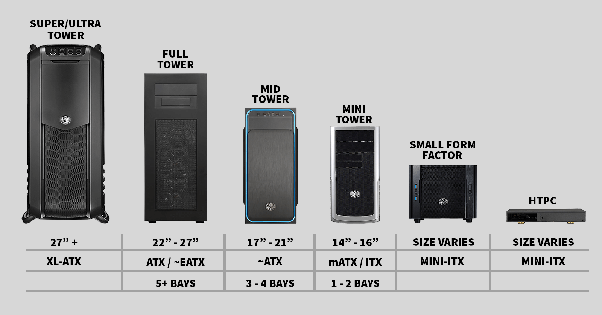
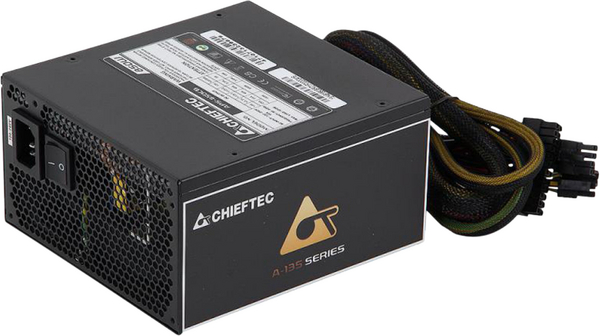
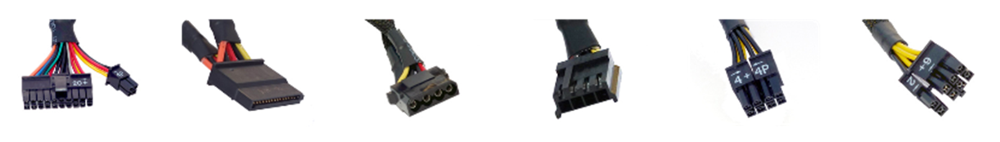

# Кућиште и напајање рачунара

## Кућиште рачунара

**Кућиште рачунара** (енгл. *Computer Case, Chassis*) служи за уградњу
унутрашњих компоненти рачунара. Кућишта се израђују према дефинисаним
стандардима што је и најбитнији фактор приликом одабира кућишта (више о
стандардима у лекцији о матичним плочама). Кућишта могу бити различитих
величина са различитим унутрашњим распоредом. При њиховој изради користе се
челик или алуминијум и пластика.

<figure markdown>
  { width="480" }
  <figcaption>PC кућишта</figcaption>
</figure>

Примарна функција кућишта је уградња унутрашњих компоненти и њихова заштита
од физичких оштећења, прашине, влаге и електромагнетних зрачења. Битна одлика
приликом дизајна кућишта је проток ваздуха, који се оствару вентилаторима и
вентилационим отворима који помажу у расипању топлоте, као и унутрашњом
организацијом места за уградљу компоненти и организацијом каблова.

Кућишта имају отворе и/или лежишта за уградњу унутрашњих компоненти, па
приликом одабира кућишта треба водити рачуна о величини и броју уређаја које
треба уградити (нпр. број HDD или SSD уређаја и величина графичке картице).
Естетика (облици, стаклени панели, RGB осветљење и сл.) не треба да буде кључни
разлог приликом одабира кућишта.

Кућишта долазе са I/O (улазно/излазним) конекторима који омогућују лак приступ
USB или другим портовима и аудио прикључцима за повезивање периферних уређаја
па треба обратити пажњу и на стандарде конектора на кућишту.

## Јединица за напајање

**Јединица за напајање** рачунара (енгл. *PSU – Power Supply Unit*) обезбеђује
електричну енергију одговарајућих карактеристика осталим компонентама у
кућишту. Примарна функција напајања је да претвара наизменичну струју напона
230V из електричне дистрибутивне мреже у једносмерну струју одговарајућег
напона (+12V, +5V и +3.3V).

<figure markdown>
  { width="320" }
  <figcaption>Јединица за напајање</figcaption>
</figure>

Снага нашајања изражава се у ватима [W], што указује на максималну количину
енергије коју може да испоручи компонентама. Због тога, напајање треба одабрати
на основу захтева за снагом компоненти које ће напајати. Ефикасност напајања
представља меру колико ефикасно се претвара наизменична струја у једносмерну
(колики су губици у виду топлоте), на шта указују оцене ефикасности - 80 PLUS
сертификати (Bronze, Silver, Gold, Platinum и Titanium).

Колика снага напајања је довољна? У "просечном" рачунарском систему компоненте
могу да имају следеће потребе за напајањем:

| Компонента                      | Потрошња (W) |
|---------------------------------|--------------|
| Процесор                        | 50 – 150     |
| Матична плоча                   | 25 – 80      |
| Оперативна меморија (по модулу) | 2 – 5        |
| Графичка картица                | 25 – 350     |
| Остале додатне картице          | 5 – 20       |
| Хард диск                       | 15 – 30      |
| SSD                             | 1 – 15       |
| CD/DVD                          | 15 – 30      |

За конкретан случај посетите [страницу са калкулатором напајања](https://www.newegg.com/tools/power-supply-calculator/).

Модерна напајања имају уграђене безбедносне функције као што су заштита од
високог напона (OVP), заштита од ниског напона (UVP), заштита од прекомерне
струје (OCP) и заштита од кратког споја (SCP) чиме се смањује могућност
оштећена компоненти.

Најапање треба изабрати и на основу фактора облика кућишта (нпр. ATX, mATX, SFX
и др.) и потребних конектора за компоненте. Конектори који долазе из напајања
обично су:

- 20-пински или 24-пински конектор (конектује се на матичну плочу)
- SATA конектор (обично се конектује на меморије за складиштење)
- Molex конектор (обично се конектује на меморије за складиштење)
- Berg конектор (обично се конектује на флопи диск драјвове – застарео)
- 4-пински до 8-пински конектор (конектује се на матичну плочу)
- 6-пински или 8-пински PCI-E конектор (обично се конектује на графичку картицу)

<figure markdown>
  { width="640" }
  <figcaption>Конектори напајања</figcaption>
</figure>

## Питања за проверу знања?

- Чему служи кућиште рачунара?
- На шта треба обратити пажњу приликом одабира кућишта?
- Која је примарна фунцкија напајања?
- На шта указује снага, а на шта ефикасност напајања?
- На шта треба обратити пажњу приликом одабира напајања?
