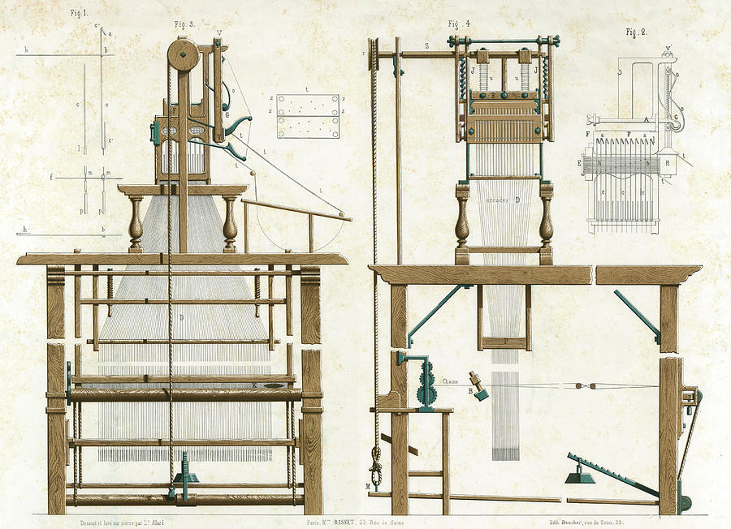

# Историјат развоја рачунара

## Почетак

Настанком људске цивилизације човек је морао да научи да броји и рачуна како би
могао да се бави трговином, разменом, одржавањем инвентара и сл. Древни народи
користили су разна помагала како би нешто избројали или извршили основне
аритметичке операције. Прва справа за рачунање настала је цца. 2500 година пре
нове ере у Вавилону и звала се **Абакус**. Овај изум је значајан јер је увео
позиционо означавање бројева који се и данас користи.

<figure markdown>
  { width="320" }
  <figcaption>Абакус</figcaption>
</figure>

Индијски математичар Пингала, 200 година пре нове ере, први је описао бинарни
бројни систем и запис бинарним кодом. 125 година пре нове ере коринћани су
направили механички уређај са зупчаницима, а двесто година касније, грчки
математичар у Александрији направио је механички уређај који понавља задату
операцију. У првој деценији нове ере, у Кини су први пут коришћени негативни
бројеви. У средњем веку развија се математика, криптографија и механика, и
почело се са израдом аналогних машина. 1493. године, Леонардно да Винчи
**скицирао је механички калкулатор** који је могао да сабира и одузима бројеве.

<figure markdown>
  { width="320" }
  <figcaption>Скица механичког калкулатора</figcaption>
</figure>

Први механички калкулатор изумео је и направио француски математичар Блез
Паскал 1642. године и назвао га аритметичка машина, а касније **Паскалина**.
Паскалина је могла директно да сабере два унета броја, или да их помножи
вишеструким понављањем операције сабирања. У годинама које следе, у Енглеској,
Немачкој, Италији и Француској креиране су сличне механичке машине.

<figure markdown>
  { width="320" }
  <figcaption>Паскалина</figcaption>
</figure>

## XIX век

Прву аутоматску програмабилну машину направио је Жозеф Мари Жакар 1804. године.
Његов **разбој за ткање** програмирао се бушеним картицама.

<figure markdown>
  { width="320" }
  <figcaption>Жакардов разбој за ткање</figcaption>
</figure>

Први **механички рачунар** - аналитичку машину, направио је Чарлс Бебиџ 1822. у
Енглеској. Ада Бајрон Лавлејс је, 1842. године, написала *алгоритам* за рад са
аналитичком машином , који се сматра првим примером рачунарског програмирања.
Џорџ Бул је, 1854. године, описао бинарни систем за симболичко и логичко
расуђивање, који је постао основа за развој модерних рачунара.

<figure markdown>
  { width="320" }
  <figcaption>Бебиџова машина</figcaption>
</figure>

## Рани XX век

Компанија IBM је стандардизовала бушене картице као медиј за унос информација у
рачунар, 1928. године у Сједињеним Америчким Државама. Око 1930. године, такође
у САД-у, Ваневр Буш направио је први **електромеханички рачунар**, а у
Немачкој, Конрад Цузе направио је први бинарни механички рачунар Z1. Други
светски рат поставио је високе захтеве за обрадом података – од обимних
израчунавања до криптографије и криптоанализе. Од 1939. године па све до краја
II светског рата електронски рачунари се паралелно развијају у Немачкој,
Великој Британији и САД-у.

<figure markdown>
  { width="320" }
  <figcaption>Eлектромеханички рачунар</figcaption>
</figure>

Велику улогу у развоју рачунара имали су и Алан Тјуринг и Џон вон Нојман.
Тјуринг, енглески математичар и криптограф, сматра се оцем теоретског
рачунарства јер је направио апстрактни модел рачунара познат као Тјурингова
машина. Вон Нојман, мађарско-амерички математичар и научник, поставио је
основне принципе архитектуре рачунара.

## Генерације електронских рачунара

**Прву генерацију** рачунара карактерише

- Технологија: електронске вакумске цеви
- Програмски језици: машински програмски језици
- Главна меморија: магнетне траке и магнетни добоши
- Улаз-излаз: папирне траке и бушене картице
- Брзина/димензије: веома спори, огромних димензија

Најпознатији рачунари прве генерације су: ENIAC *(енгл. Electronic Numerical
Integrator and Computer)*, EDVAC *(енгл. Electronic Discrete Variable Automatic
Computer)*, UNIVAC *(енгл. Universal Automatic Computer)*, IBM 650, IBM 701
итд.

<figure markdown>
  { width="320" }
  <figcaption>ENIAC</figcaption>
</figure>

**Другу генерацију** рачунара карактерише:

- Технологија: транзистори
- Програмски језици: машински и асемблерски програмски језици
- Главна меморија: магнетна језгра и магнетне траке/дискови
- Улаз-излаз: магнетне траке и бушене картице
- Брзина/димензије: бржи и мањи у односу на прву генерацију

Најпознатији рачунари друге генерације су: PDP-8, IBM 1400, IBM 7090, IBM 7094,
UNIVAC 1107, CDC 3600 итд.

<figure markdown>
  { width="320" }
  <figcaption>IBM 7090</figcaption>
</figure>

**Трећу генерацију** рачунара карактерише:

- Технологија: интегрисана кола
- Програмски језици: програмски језици високог нивоа
- Главна меморија: велика магнетна језгра и магнетне траке/дискови
- Улаз-излаз: магнетне траке, тастатуре, монитори, штампачи
- Брзина/димензије: знатно бржи и мањи у односу на претходне генерације

Најпознатији рачунари треће генерације су: IBM System/360, IBM System/370,
PDP-11, NCR 395, Burroughs B6500 итд.

<figure markdown>
  { width="320" }
  <figcaption>IBM System/370</figcaption>
</figure>

**Четврту генерацију** рачунара карактерише:

- Технологија: микропроцесори - интеграција веома великих размера *(енгл. VLSI,
Very Large-Scale Integration)*
- Програмски језици: програмски језици високог нивоа
- Главна меморија: полупроводничкe меморијe
- Улаз-излаз: тастатуре, показивачки уређаји, монитори, скенери, штампачи…
- Брзина/димензије: константан раст брзине, различите димензије

Електронски рачунари четврте генерације реализовани су као персонални рачунари,
преносиви рачунари, сервери, суперрачунари, паметни телефони, таблети итд.
Рачунари који су започели четврту генерацију су IBM PC, APPLE II, Apple
Macintosh и др.

<figure markdown>
  { width="320" }
  <figcaption>IBM PC</figcaption>
</figure>

Сматра се да ће технологија **пете генерације** рачунара бити технологија
заснована на интеграцији ултра-великих размера *(енгл. ULSI – Ultra Large-Scale
Integration)*, паралелној обради и вештачкој интелигенцији. Тренутно се
развијају и квантни рачунари – најпопуларнији представници пете генерације.

<figure markdown>
  { width="320" }
  <figcaption>Квантни рачунар компаније Google</figcaption>
</figure>

## Питања за проверу знања

Повежи године и изуме:

- Прва справа за рачунање - 2500. пне
- Први механички калкулатор - 1642.
- Прва аутоматска програмабилна машина - 1804.
- Први механички рачунар - 1822.
- Први електромеханички рачунар - 1930.

Повежи генерацијe и технологије електронских рачунара:

- Прва генерација електронских рачунара - електронске вакумске цеви
- Друга генерација електронских рачунара - транзистори
- Трећа генерација електронских рачунара - интегрисана кола
- Четврта генерација електронских рачунара - микропроцесори
