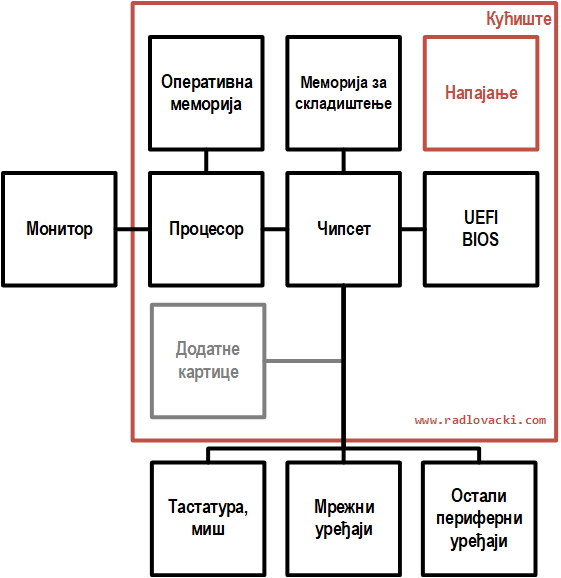

# Матична плоча

**Матична плоча** (енгл. *Mainboard, Motherboard*) повезује хардверске
компоненте рачунара и утиче на њихову брзину и ефикасност у раду. На
матичној плочи налази се:

- лежиште за процесор,
- слотови за меморију,
- системски чип(ови),
- BIOS/UEFI и батерија,
- магистрале и експанзиони слотови и
- разни конектори.

<figure markdown>
  { width="100%" }
  <figcaption>Матична плоча</figcaption>
</figure>

**Лежиште за процесор** (енгл. *Socket*) обезбеђује механичку и електричну везу
између процесора и матичне плоче. У употреби су LGA (енгл. *Land Grid Array*)
и ређе PGA (енгл. *Pin Grid Array*) типови лежишта.

<figure markdown>
  { width="320" }
  <figcaption>PGA и LGA лежишта за процесоре и процесори</figcaption>
</figure>

**Слотови за меморију** (енгл. *Memory Slots*) обезбеђују механичку и
електричну везу између меморијских модула и матичне плоче. Обично их има два
или више.

<figure markdown>
  { width="320" }
  <figcaption>Уметање DDR5 модула у меморијски слот</figcaption>
</figure>

**Системски чип(ови)** (енгл. *Chipset*) омогућују комуникацију између
различитих компоненти рачунара и контролишу њихов рад. Данас је то један чип,
(енгл. *PCH - Platform Controller Hub*) док су на старијим плочама постојала
два (енгл. *Northbridge* и *Southbridge*). Системски чип је обично покривен
алуминијумским хладњаком. Његова улога јаснија је на упрошћеној блок шеми
савременог рачунарског система.

<figure markdown>
  { width="320" }
  <figcaption>Савремени рачунарски систем</figcaption>
</figure>

**BIOS** (енгл. *Basic Input Output System*) тј. **UEFI** (енгл. *Unified
Extensible Firmware Interface*) је меморијски чип (ROM) у којем се налази
софтвер и подаци који омогућују тестирање хардвера, системска подешавања и
почетак рада система. **Батерија** пружа константно електрично напајање за
BIOS/UEFI, које је потребно за функционисања часовника и датума и чување
података о системским подешавањима.

**Магистрала** (енгл. *Bus*) представља скуп електричних веза између
компонената матичне плоче или компонената и конектора. **Експанзиони слотови**
(енгл. *Expansion Slots*) обезбеђују механичку и електричну везу између
додатних картица и матичне плоче. Данас су највише присутне варијанте PCI-E
слотова, док су се раније користили ISA, PCI и AGP слотови.

**Конектори на матичној плочи** обично су: конектори за напајање плоче,
конектори за вентилаторе, конектори за контроле на кућишту рачунара, конектори
за уређаје за складиштење итд. **Конектори на полеђини кућишта** који долазе са
матичне плоче обично су: PS/2 конектори за тастатуру и миша, USB конектори и
конектори од интегрисаних уређаја (графички, мрежни и звучни адаптер) итд.

<figure markdown>
  { width="480" }
  <figcaption>Конектори на полеђини кућишта</figcaption>
</figure>

**Фактор облика матичне плоче** (енгл. *Form Factor*) односи се на величину и
облик плоче и распоред различитих компоненти на плочи. Током година било је
много варијација фактора облика, а најпознатији су Standard Advanced Technology
eXtended (ATX) и Micro-ATX у десктоп рачунарима и ITX у тин-клијентима.

<figure markdown>
  { width="480" }
  <figcaption>Фактор облика матичне плоче</figcaption>
</figure>

## Питања за проверу знања

- Чему служи матична плоча?
- Која је улога лежишта за процесор, слотова за меморију и експанзионих слотова
на матичној плочи?
- Која је улога системских чипова на матичним плочама?
- Шта је BIOS/UEFI и чему служи батерија на матичној плочи?
