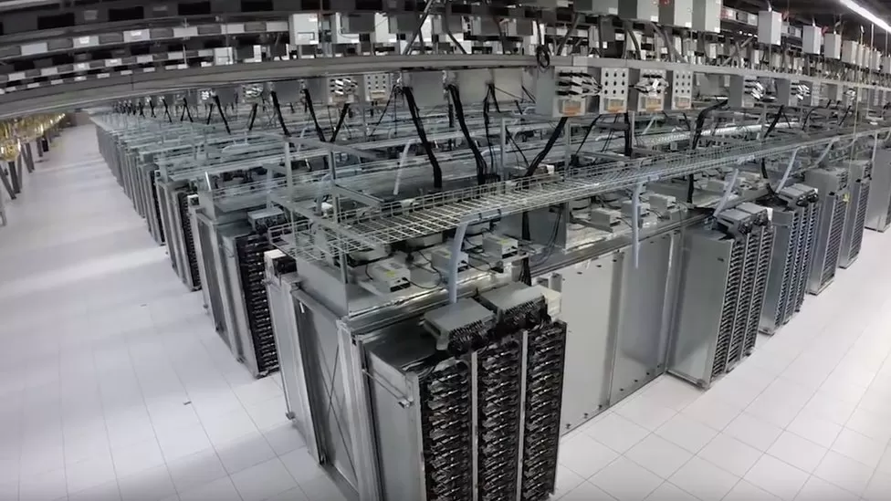
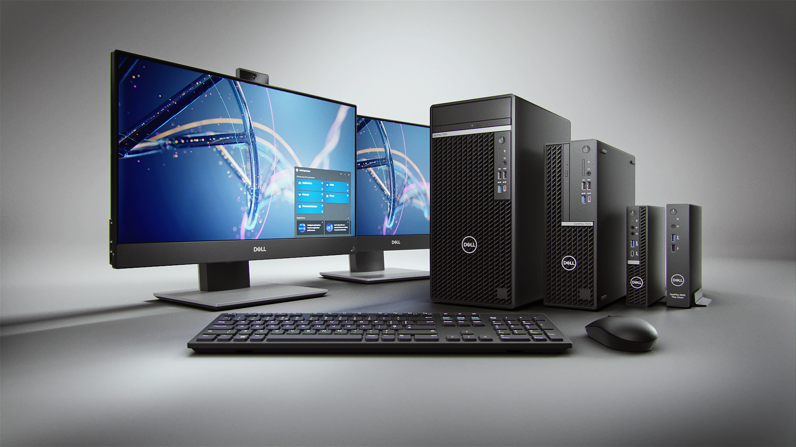
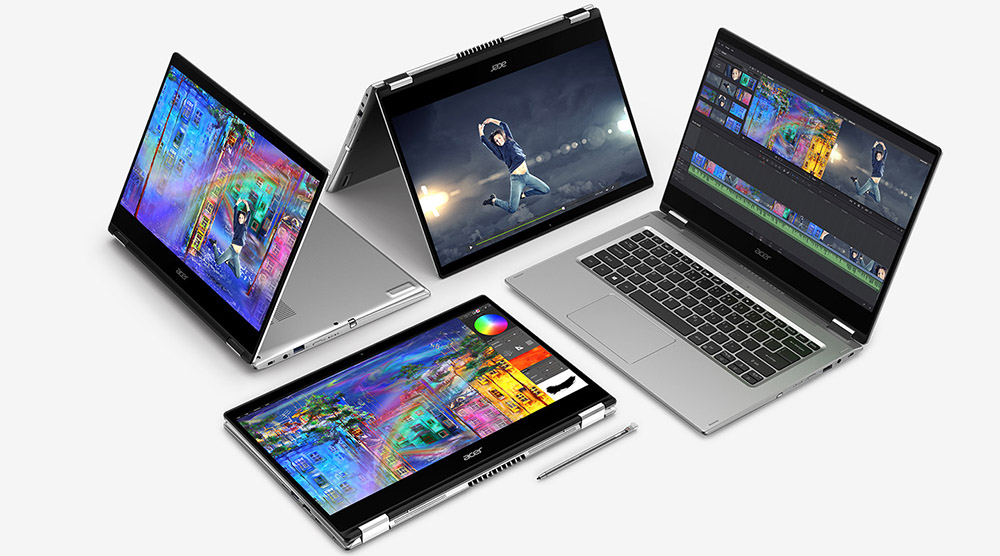
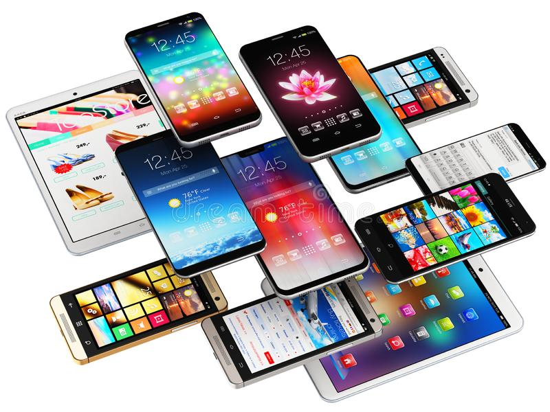
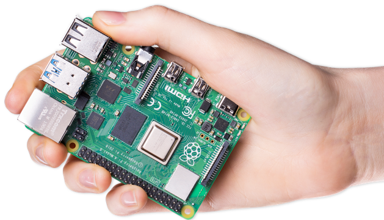
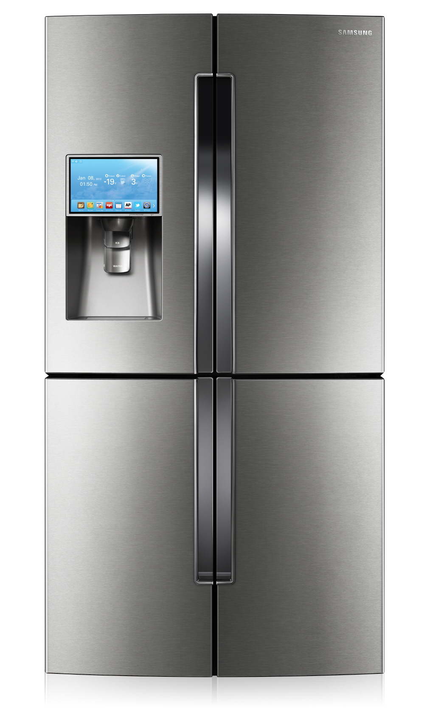
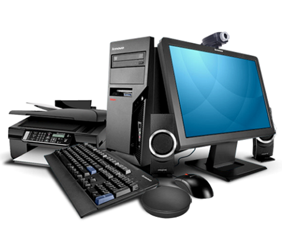
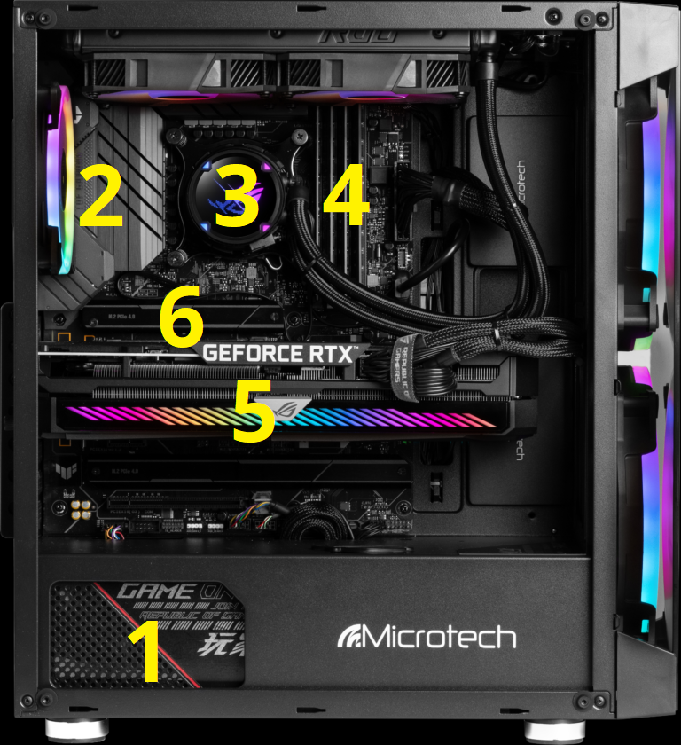
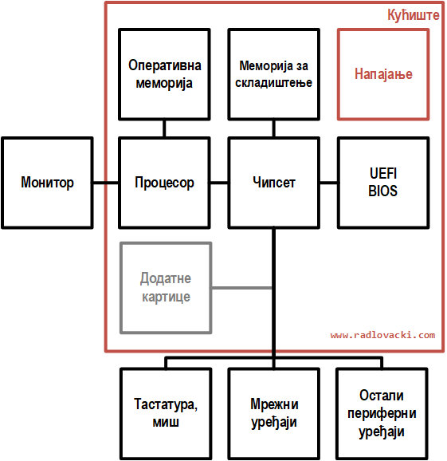

# Појам хардвера и софтвера, рачунарски систем

У претходној лекцији упознао си се са историјом развоја рачунара, па сада можеш
дефинисати појам рачунара. **Рачунар** је уређај који самостално обавља обраду
података извршавајући инструкције програма. **Рачунарски систем** представља
скуп средстава који се користе приликом рада на рачунару. Та средства могу бити
физичка (хардвер) или програмска (софтвер). Појам **хардвер** односи се на
физичке компоненте рачунарског система. Појам **софтвер** односи се на
програмске компоненте рачунарског система.

**Архитектура рачунарског система** односи се на функционалност и организацију
система. **Конфигурација рачунарског система** односи се на хардверске
компоненте система.

## Типови рачунарских система

Савремене рачунарске системе можемо **поделити** на: супер-рачунаре, сервере,
десктоп рачунаре, лаптоп рачунаре, таблете и паметне телефоне, рачунаре
изведене на једној плочи и уграђене рачунаре.

**Супер-рачунари и сервери** налазе се у дата-центрима, великим компанијама,
научно-истраживачким институтима и сл. Великих су габарита, троше много
електричне енергије и захтевају посебне услове за рад. За разлику од осталих
рачунарских система, ови рачунари имају много веће перформансе, обично
опслужују велики број корисника и обављају велики број послова истовремено и
непрекидно.

<figure markdown>
  { width="320" }
  <figcaption>Супер-рачунари и сервери</figcaption>
</figure>

**Десктоп рачунари** су рачунари опште намене који се користе у домаћинствима,
канцеларијама, учионицама итд. Назив су добили јер се обично налазе на столу
(енгл. *desk*). Извор напајања десктоп рачунара захтева прикључак на електричну
мрежу, па ови рачунари нису преносиви, односно мобилни. О десктоп рачунарима
биће много више речи у овој и наредним лекцијама.

<figure markdown>
  { width="320" }
  <figcaption>Десктоп рачунари</figcaption>
</figure>

**Лаптоп рачунари**, су такође рачунари опште намене. Назив су добили јер се
током рада могу држати у крилу (енгл. *lap*). Како би били мобилни и што дуже
оперативни са независним извором напајања (батеријом), имају лошије перформансе
него десктоп рачунари сличних карактеристика.

<figure markdown>
  { width="320" }
  <figcaption>Лаптоп рачунари</figcaption>
</figure>

**Таблети и паметни телефони** су рачунарски системи малих димензија који током
рада користи независан извор напајања. Поседују екран на додир и један или више
тастера као једини интерфејс за рад.

<figure markdown>
  { width="320" }
  <figcaption>Таблети и паметни телефони</figcaption>
</figure>

**Рачунари изведени на једној плочи** (енгл. *Single-Board Computers*) су
потпуно функционални рачунари који се користе као системи за развој или
уградњу у друге уређаје.

<figure markdown>
  { width="320" }
  <figcaption>Рачунар изведен на једној плочи Raspberry Pi 4</figcaption>
</figure>

**Уграђене рачунаре** (енгл. *Embedded Computers*) данас налазимо свуда, од
потрошачких уређаја, уређаја у домаћинствима или компанијама, до возила,
индустријских постројења итд.

<figure markdown>
  { width="320" }
  <figcaption>Паметни фрижидер са уграђеним рачунаром</figcaption>
</figure>

## Хардвер десктоп рачунара

У овој и наредним лекцијама изучаваћемо **савремене персоналне десктоп
рачунаре**. Персонални рачунар изведен је у кућишту, поред којег се налази
тастатура, миш, монитор, штампач и остали периферни уређаји.

<figure markdown>
  { width="320" }
  <figcaption>Персонални десктоп рачунар</figcaption>
</figure>

У кућишту персоналног рачунара налазе се...

1. напајање,
2. матична плоча,
3. процесор и хладњак,
4. оперативна меморија,
5. додатне картице (опционо),
6. меморија за складиштење

<figure markdown>
  { width="320" }
  <figcaption>Унутрашњост кућишта десктоп рачунара</figcaption>
</figure>

...а поред кућишта, обично се налазе следећи периферни уређаји:

- тастатура,
- миш,
- монитор,
- микрофон и звучници (или слушалице са микрофоном)
- штампач, скенер или мултифункцијски уређај,
- мрежни уређај (свич, приступна тачка, рутер...) итд.

Савремени рачунарски систем можемо посматрати и кроз следећу поједностављену
блок шему:

<figure markdown>
  { width="320" }
  <figcaption>Савремени рачунарски систем</figcaption>
</figure>
