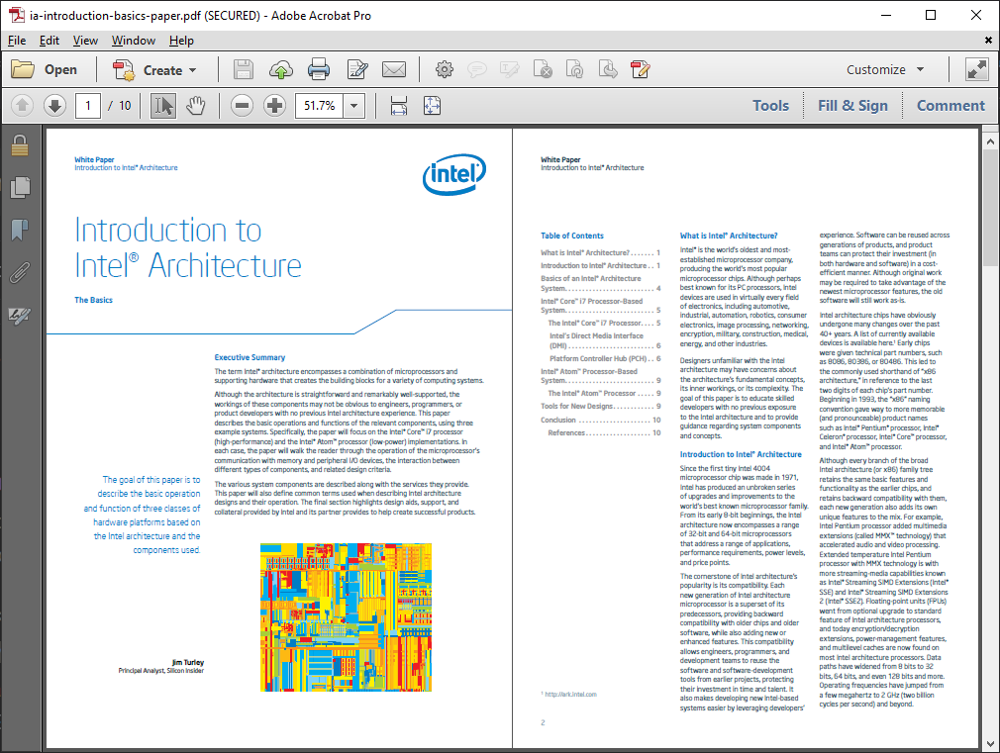

# Кориснички и пројектно оријентисана документација

У софтверском имжењерству и информационим технологијама, техничка докуемнтација
може се поделити на:

- кориснички оријентисане документе (екстерна документација) и
- пројектно оријентисане документе (интерна документација).

## Кориснички оријентисана документација

У кориснички оријентисану документација могу се уврстити:

### Технички лист *(Datasheet)*

<figure markdown>
  
  <figcaption>Datasheet</figcaption>
</figure>

### Упутство за корисника *(User’s Guide)*

<figure markdown>
  
  <figcaption>User’s Guide</figcaption>
</figure>

### Технички референтни приручник *(Technical Reference Manual)*

<figure markdown>
  
  <figcaption>Technical Reference Manual</figcaption>
</figure>

### Примене и напомене *(Application Notes)*

<figure markdown>
  
  <figcaption>Application Notes</figcaption>
</figure>

### Исправке *(Errata)*

<figure markdown>
  
  <figcaption>Errata</figcaption>
</figure>

### Схеме *(Schematics)*

<figure markdown>
  
  <figcaption>Schematics</figcaption>
</figure>

### Упутство за сервисирање *(Service Manual)*

<figure markdown>
  
  <figcaption>Service Manual</figcaption>
</figure>

### Извештај о тестирању *(Test Report)*

<figure markdown>
  
  <figcaption>Test Report</figcaption>
</figure>

### Туторијал *(Tutorial)*

<figure markdown>
  
  <figcaption>Tutorial</figcaption>
</figure>

### Бела књига *(White Paper)*

<figure markdown>
  
  <figcaption>White Paper</figcaption>
</figure>

## Пројектно оријентисана документација

У пројектно оријентисану документација могу се уврстити:

### Спецификација захтева *(Specification Requirements)*

<figure markdown>
  
  <figcaption>Specification Requirements</figcaption>
</figure>

### Документ о дизајну *(Design Document)*

<figure markdown>
  
  <figcaption>Design Document</figcaption>
</figure>

### Спецификација тестирања *(Test Specification)*

<figure markdown>
  
  <figcaption>Test Specification</figcaption>
</figure>

### Документација генерисана из изворног кода *(Source Code Generated Documentation)*

<figure markdown>
  
  <figcaption>Source Code Generated Documentation</figcaption>
</figure>
