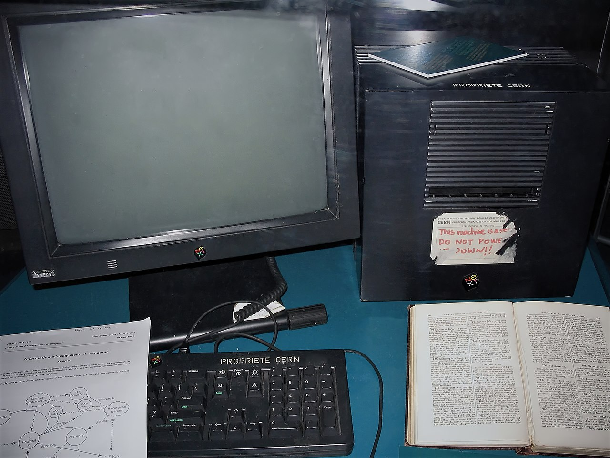

# Основни појмови и значај веб технологија

Веб *(енгл. World Wide Web)* је у свом најједноставнијем облику систем
међусобно повезаних хипертекстуалних докумената који се налазе на интернету.
Хипертекстуални документ је текстуална датотека формирана језиком за опис
хипертекста *(енгл HTML - HyperText Markup Language)*. Помоћу веб-прегледача
*(енгл. Web Browser)*, односно веб-клијената, корисници могу да виде садржај
хипертекстуалног догумента који се назива и веб-страница *(енгл. Web Page)*.
Веб-странице веб-прегледачу испоручује веб-сервер *(енгл. Web Server)* путем
протокола за пренос хипертекста *(енгл. HTTP - Hypertext Transfer Protocol)*
или чешће, путем безбедног протокола за пренос хипертекста *(енгл. HTTPS -
Hypertext Transfer Protocol Secure)*.

Веб је креирао енглез Тим Бернерс-Ли *(енгл. Tim Berners-Lee)* радећи у
Швајцарској у Европској организацији за атомска истраживања *CERN*. Пројекат је
започет 1989. године са циљем да олакша размену информација међу научницима
коришћењем хипертекст система. Резултат пројекта представљен је 1990. године у
виду два програма:

- веб-прегледача *WorldWideWeb*, касније преименованог у Nexus и
- веб-сервера *CERN httpd*.

<figure markdown>
  { width="480" }
  <figcaption>NeXT рачунар са првим веб сервером</figcaption>
</figure>

Веб је имао, а и даље има, централну улогу у развоју информационог друштва и
примарни је алат који милијарде људи употребљава свакодневно на интернету. У
свом основном облику веб није имао много могућности за интеракцију - био је
само велика база информација са примитивним техникама за индексирање и
претраживање. Развојем **програмских језика за веб програмирање**, дошло је до
развоја веб апликација.

**Веб апликације** постале су незаобилазни део свакодневног приватног и
пословног живота људи. Користе се: за електронску пошту; за комуникацију
порукама, гласом или видеом; за имплементацију друштвених мрежа, портала,
форума и веб сајтова; за електронско и банкарско пословање; за пословање у
организацијама, администрацију и канцеларијске послове; за имплементацију
сервиса јавне управе итд. Тешко би било пронаћи неку људску делатност за коју
не постоји веб апликација, а још теже навести све делатности у којима се
користе веб апликације.

Овај предмет у блиској је вези са предметима које си учио претходне, које учиш
ове и које ћеш учити наредне школске године - највише са предметима веб дизајн,
програмирање и базе података. Теме са којима ћеш се упознати ове школске године
могу се угрубо представити у пет целина:

- увод у веб технологије,
- објектно оријентисано програмирање у програмском језику C#,
- серверски скрипт језик *ASP.NET Core*,
- клијентски скрипт језик *JavaScript* и
- веб сервер *Microsoft IIS*.
